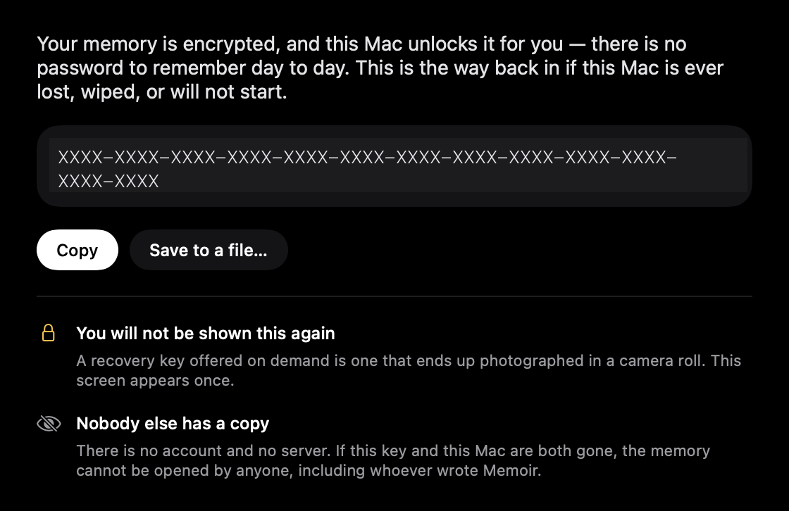

# Using Memoir

First run, everyday use, and how to get your memory back out.

## First run

<div align="center">
  
</div>

Five screens, about a minute. Two matter:

- **Your recovery key, shown once.** Your Mac unlocks the memory for you, so there is no
  password day to day, which means a keychain holds it, and a keychain does not survive a wiped
  disk. Nobody else has a copy: no account, no server, no reset.
- **Where your memory starts.** One button reads your **Contacts** (names only), up to ten years
  of **Calendar** (what you were doing and who was there, including Google and Exchange accounts
  set up in the Mac's Calendar app), and your **photo library**: the date and rough location of
  each picture, never the picture itself, not even a thumbnail, and screenshots skipped.
  Read-only, never written back, and re-read hourly so a contact you add next month is known too.
  Decline any of them and the memory fills from today instead; turn them on later in
  **Settings → Vault**.

Point **Settings → Vault** at a markdown folder and your own project names are in the memory
from the first session too.

## Everyday use

**⌥Space** opens the band. Ask in plain language, or dictate; speech is transcribed on-device
and never written to disk.

The **Memory** window lists everything Memoir believes: people, projects, threads, decisions,
commitments, notes. Select any row to see where it came from (the exact snippet, which app,
when) and whether it is something **you wrote** or something Memoir **inferred**.

**What it will not claim.** It refuses questions it cannot ground: money, meals, phone calls,
anything in the future. Absence is reported as absence, never as denial: coverage varies by
app, so "there is nothing in the record" never becomes "it did not happen".

When answers look wrong, ask the doctor first:

```bash
swift run memoir-ask --doctor
```

It reports whether capture is reaching the present, which apps read as nothing, and how much is
being asserted as owed.

You should rarely need it. **The notch tells you whether it is recording**: the mark's violet
half (what it saw) turns red and breathes when capture has stopped, the strip says so in
words, and the band widens once to name the cause and again every half hour until it is fixed.
A rebuild silently invalidates the Accessibility grant, and that is now visible within fifteen
seconds rather than in a wrong answer a fortnight later. Memoir also opens itself when you log
in, so a restart does not quietly end the recording, and **pausing is a length of time** (an
hour by default, counting down in the notch) rather than a switch you can forget you flipped.

## Taking it with you

**Settings → Data → Export** writes the whole memory as JSON (every entity, every quote of
evidence behind it, every session) plus a readable Markdown summary. There is a way out that is
not deletion (CF-9), and **Delete everything** removes the bytes rather than hiding the rows.
