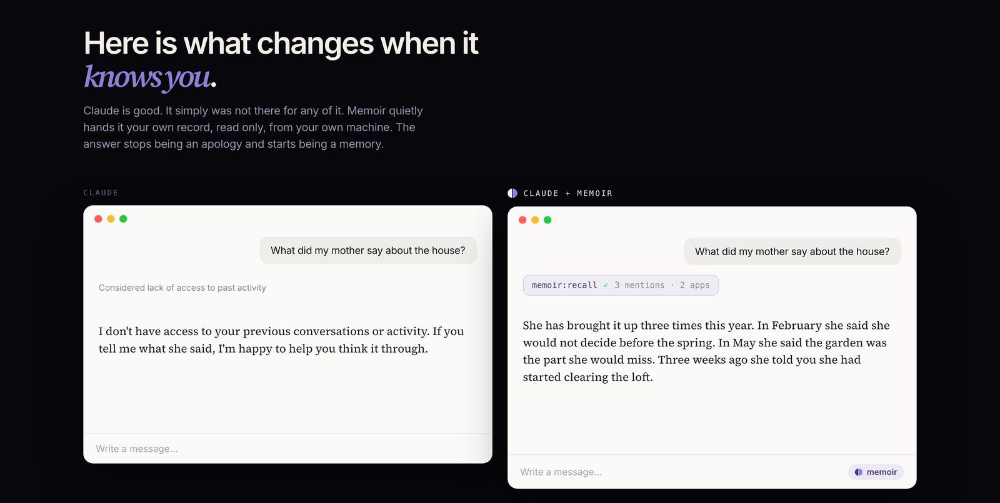

<div align="center">


**A memory of your own life, on your own Mac.** Memoir reads the text your apps already publish
to macOS for screen readers, keeps it in one encrypted file that never leaves the machine, and
lets any AI you already use read it back, with a citation on every claim.

*It advises. It never acts on your behalf.*

[](LICENSE)
[](#requirements)
[](Package.swift)

**[Quickstart](#quickstart)** · **[Privacy](PRIVACY.md)** · **[MCP](#mcp)** ·
**[Guide](Docs/GUIDE.md)** · **[Comparison](Docs/COMPARISON.md)**

</div>

---

The models that already have memory remember one version of you: the one in the chat window.
They know what you *told* them, not what you *did*. Memoir is the other half. Given a few years
of it, what it can answer stops looking like search.

> **You told Marco you would read his draft. Three weeks ago.**
>
> **Every autumn since 2023 you start looking at flats in the same neighbourhood.**

<div align="center">
  
</div>

## Quickstart

```bash
bash Scripts/build-app.sh && open build
```

Drag `Memoir.app` to Applications and launch it. Memoir lives in the **notch**: no dock icon,
no main window. Grant Accessibility in System Settings → Privacy & Security; it starts working
the moment you do, no relaunch.

Then connect the agent you already use:

```bash
claude mcp add --scope user memoir -- /Applications/Memoir.app/Contents/MacOS/memoir-mcp
```

and ask it *what did I work on yesterday*, *what have I promised Marco*, or *when did the
Fenwick decision actually get made*.

**⌥Space** opens the band to ask Memoir directly. First run is five screens and about a minute;
see the **[guide](Docs/GUIDE.md)** for what those screens decide, and for how to export
everything again.

### Requirements

|  |  |
|---|---|
| **To run** | macOS 15+, Apple Silicon. macOS 26 recommended: the on-device brain and the newer speech models need it, and Memoir degrades gracefully without them |
| **To build** | The macOS 26 SDK (Xcode 26). Speech is guarded with `@available(macOS 26.0, *)`, so it runs on 15 but the symbols must exist to compile |
| **Dependencies** | None. Apple frameworks and the system SQLite, nothing else |

## What it reads, and what it doesn't

**It reads** the text your apps already publish to macOS for screen readers (the accessibility
tree), plus which app is in front and whether you are idle.

**It never** takes screenshots, records the screen, records audio, or logs keystrokes. Password
managers, Keychain Access and the system's credential prompts are excluded out of the box, and
you can exclude anything else. The one exception is dictation, only when you ask for it:
transcribed by Apple's on-device models, never uploaded, never written to disk.

**Where it goes:** one SQLite file inside an AES-256 container macOS encrypts, at
`~/Library/Application Support/Memoir/`. The key lives in your login keychain, marked
device-local, so it never syncs. Every brain that can send anything is off by default, and
Settings shows a live count of what has actually left, incremented by the code that sends,
not inferred afterwards.

Full detail, including what encryption does **not** protect, in **[PRIVACY.md](PRIVACY.md)**.

## Specs

- **~10.7 KB per capture** on disk, index included: about 125 MB a month at 400 captures a day,
  and ~15 GB over a decade. Measured on one real database: 12,490 captures, 131.5 MB.
- **Four ways to answer**, and Memoir always shows which one did: **no model** (templates over
  your own data, always available), **on-device** Apple Foundation Models, the **Anthropic API**,
  or **Claude Code** if you already have it. The two that leave the Mac are off until you switch
  them on. A model on your own network (Ollama, LM Studio, vLLM) has a switch of its own.
- **Provenance on every row.** Every claim cites the capture behind it: which app, and when.
- **Authored beats inferred, always.** Nothing Memoir guesses can overwrite something you wrote,
  and a correction is permanent.
- **It refuses what it cannot ground**: money, meals, phone calls, anything in the future. And
  absence is reported as absence, never as denial.

## MCP

`memoir-mcp` is a separate binary that opens the database **read-only, three separate ways**.
Claude Code, Claude Desktop, Cursor, Windsurf and Zed can consult your memory, and none of them
can change it.

Use **Settings → Agents** in the app: it lists every client on the Mac and connects them one
click each. By hand, see **[Docs/MCP.md](Docs/MCP.md)**.

| Tool | Answers |
|---|---|
| `recall`, `who_is`, `what_happened` | free text, a person, a date range |
| `working_set`, `what_changed_since`, `prior_art` | what is in play, catch me up, have I been here before |
| `sources_for`, `verify` | the quotes behind a claim; supported / stale / absent |
| `timesheet`, `today`, `open_commitments` | measured time, a daily brief, what you owe |
| `propose_memory` | stages a suggestion for you to accept. It cannot write |

## Limitations

- **Electron and canvas apps** publish a poor accessibility tree, or none. Coverage is graded per
  app in Settings so you can see where it is thin rather than meeting it in a wrong answer.
- **Cold start.** Contacts, Calendar and a notes folder fill most of it, but the deep answers,
  the ones about years, need years.
- **Window titles need Screen Recording permission.** Without it Memoir degrades to app names.
- **Voice is input only.** You can dictate a question; Memoir does not speak its answers.
- **macOS only.** Windows if the capture story ever becomes viable.
- **No published release yet.** Signing and notarisation work (a DMG was notarised and accepted
  by Apple in August 2026), but nothing is published to download, so building from source is the
  route. See **[Docs/RELEASING.md](Docs/RELEASING.md)**.

## Documentation

| | |
|---|---|
| [PRIVACY.md](PRIVACY.md) | What is read, what leaves, what encryption does and does not protect |
| [Docs/GUIDE.md](Docs/GUIDE.md) | First run, everyday use, export and deletion |
| [ARCHITECTURE.md](ARCHITECTURE.md) | The contract: types, invariants, and why each one exists |
| [FLOWS.md](FLOWS.md) | The specification. Every behaviour is a numbered flow with a test |
| [EVALS.md](EVALS.md) | How answer quality is measured, including where the judge is a cloud model |
| [Docs/COMPARISON.md](Docs/COMPARISON.md) | Why this exists, and how it compares to the alternatives |
| [Docs/MCP.md](Docs/MCP.md) · [Docs/RELEASING.md](Docs/RELEASING.md) · [Docs/LAYOUT.md](Docs/LAYOUT.md) | Per-client MCP setup, the release path, the repository map |

## Contributing

Issues and pull requests are welcome; see **[CONTRIBUTING.md](CONTRIBUTING.md)**. In short:
`FLOWS.md` is the specification, so behaviour changes start there, and `swift test` must be green
before you push.

Security issues go to **[SECURITY.md](SECURITY.md)**, not the issue tracker.

## Licence

**[MIT](LICENSE).** Take it, fork it, ship it, build a product on it. The point of a memory you
are asked to keep for a decade is that it cannot be taken away from you, and the code being both
open and unencumbered is most of that promise: if this project stops, the format is documented,
the database is ordinary SQLite, and anyone can keep it alive.
